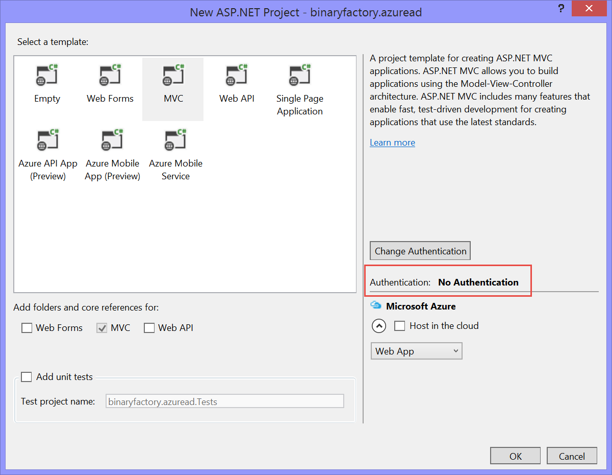
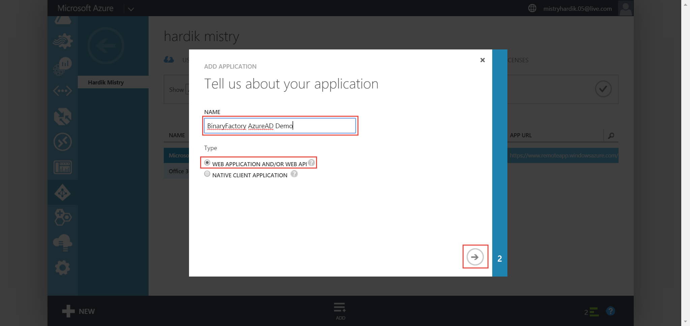
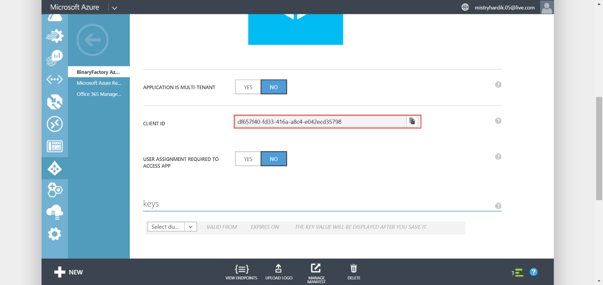
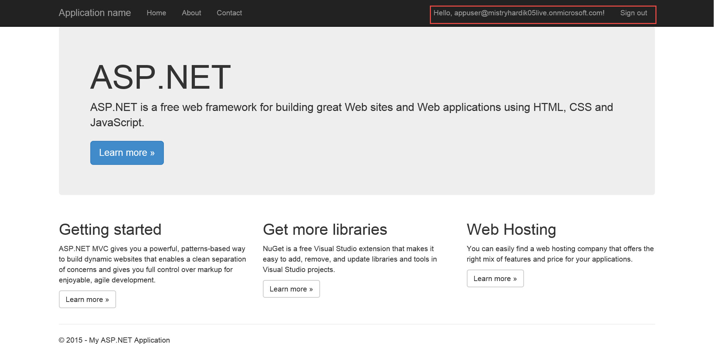

Single Sign-On your asp.net web app

1.  Add user to the Active Directory

Give a username

Fill in other details of the user you are adding, currently we are adding a user
with User Role

Copy and save the temporary password

Create a new ASP.NET MVC Web Application

Add the following packages using the Nuget Package Manager

-   Microsoft.Owin.IdentityModels.Protocol.Extensions

-   System.IdentityModel.Tokens.Jwt **(Please use v4.0.x of this package,
    upgrading to v5.0.x breaks the code)**

-   Microsoft.Owin.Security.OpenIdConnect

-   Microsoft.Owin.Security.Cookies

-   Microsoft.Owin.Host.SystemWeb

Right click App\_Start folder and Add a class, name it Startup.Auth.cs

**Code:**

using System;

using System.Collections.Generic;

using System.Linq;

using System.Text;

using System.Threading.Tasks;

using Owin;

using Microsoft.Owin.Security;

using Microsoft.Owin.Security.Cookies;

using Microsoft.Owin.Security.OpenIdConnect;

using System.Configuration;

using System.Globalization;

namespace binaryfactory.azuread //replace this namespace with your project name

{

    public partial class Startup

    {

        private static string clientId = ConfigurationManager.AppSettings["ida:ClientId"];

        private static string aadInstance = ConfigurationManager.AppSettings["ida:AADInstance"];

        private static string tenant = ConfigurationManager.AppSettings["ida:Tenant"];

        private static string postLogoutRedirectUri = ConfigurationManager.AppSettings["ida:PostLogoutRedirectUri"];

        string authority = String.Format(CultureInfo.InvariantCulture, aadInstance, tenant);

        public void ConfigureAuth(IAppBuilder app)

        {

            app.SetDefaultSignInAsAuthenticationType(CookieAuthenticationDefaults.AuthenticationType);

            app.UseCookieAuthentication(new CookieAuthenticationOptions());

            app.UseOpenIdConnectAuthentication(

                new OpenIdConnectAuthenticationOptions

                {

                    ClientId = clientId,

                    Authority = authority,

                    PostLogoutRedirectUri = postLogoutRedirectUri,

                    Notifications = new OpenIdConnectAuthenticationNotifications

                    {

                        AuthenticationFailed = context =\>

                        {

                            context.HandleResponse();

                            context.Response.Redirect("/Error?message=" + context.Exception.Message);

                            return Task.FromResult(0);

                        }

                    }

                });

        }

    }

}

Right click the project and add a OWIN Startup Class and name is Startup.cs and
add invoke ConfigureAuth(app) as shown

Right click the controllers folder and name it AccountController as shown

**Code: // copy paste the following as illustrated above**

public void SignIn()

        {

            // Send an OpenID Connect sign-in request.

            if (!Request.IsAuthenticated)

            {

                HttpContext.GetOwinContext().Authentication.Challenge(new AuthenticationProperties { RedirectUri = "/" }, OpenIdConnectAuthenticationDefaults.AuthenticationType);

            }

        }

        public void SignOut()

        {

            // Send an OpenID Connect sign-out request.

            HttpContext.GetOwinContext().Authentication.SignOut(

                OpenIdConnectAuthenticationDefaults.AuthenticationType, CookieAuthenticationDefaults.AuthenticationType);

        }

Right click the View/Shared folder and add a MVC Partial page and name it
\_LoginPartial.cshtml as shown and copy the following code

**Code:**

\@if (Request.IsAuthenticated)

{

    \<text\>

        \<ul class="nav navbar-nav navbar-right"\>

            \<li class="navbar-text"\>

                Hello, \@User.Identity.Name!

            \</li\>

            \<li\>

                \@Html.ActionLink("Sign out", "SignOut", "Account")

            \</li\>

        \</ul\>

    \</text\>

}

else

{

    \<ul class="nav navbar-nav navbar-right"\>

        \<li\>\@Html.ActionLink("Sign in", "SignIn", "Account", routeValues: null, htmlAttributes: new { id = "loginLink" })\</li\>

    \</ul\>

}

Open the \_Layout.cshtml and modified as shown below

Enable SSL to the project, to do so, left click the project and press F4 on the
keyboard and enable SSL and copy paste the url

Copy the url and replace the url from web iis express runtime

Navigate to your active directory and now register your application to support
single sign on

Copy the client id

Update the web.config of your root project as shown

Run the app

